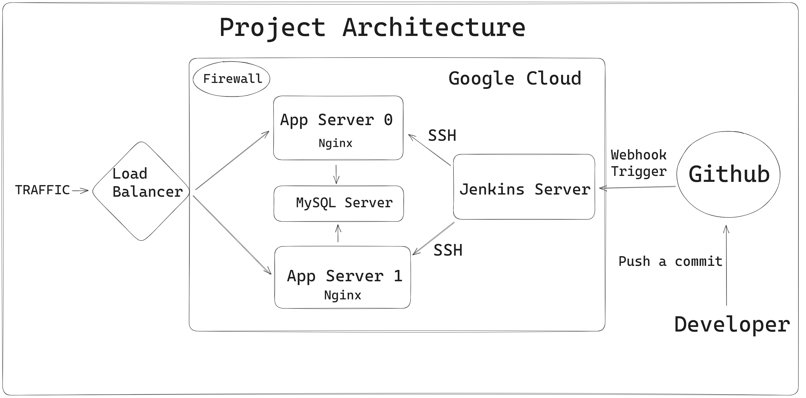

## Overview
This project demonstrates a robust web application infrastructure on Google Cloud, provisioned with Terraform, configured using Ansible, and featuring a Jenkins-based CI/CD pipeline.

## Key Features  
- **Infrastructure as Code (IaC):** Utilized Terraform for provisioning the network and virtual machines, ensuring a scalable and reproducible infrastructure.

- **Configuration Management:** Employed Ansible to automate machine configurations, making it easy to maintain and update the application environment.

- **Secure Credential Management:** Stored sensitive credentials using Ansible Vault, enhancing security and compliance.

- **CI/CD:** Implemented Jenkins to automate the test, and deployment processes, streamlining development and deployment workflows.

## Project Architecture

